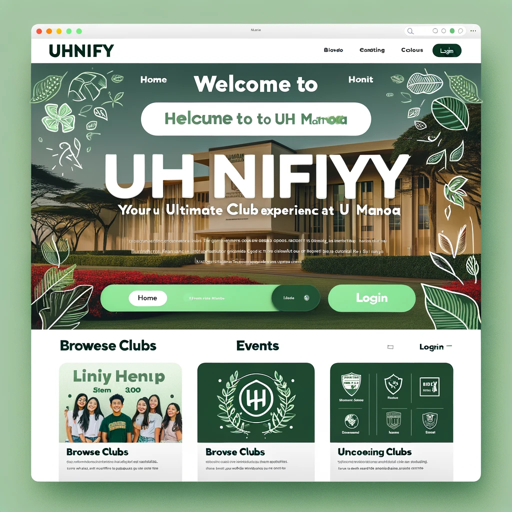

# UHnify: The Ultimate Student Club Experience for UH Manoa

Welcome to the GitHub repository for UHnify, where we're revolutionizing the way students at the University of Hawaii at Manoa connect with student clubs and each other using a comprehensive platform powered by the Meteor framework and MongoDB.

## Table of Contents
1. [Project Goals](#project-goals)
2. [System Architecture](#system-architecture)
3. [Features](#features)
4. [Pages](#pages)
5. [Use Cases](#use-cases)
6. [Deployment](#deployment)
7. [Software Engineering Practices](#software-engineering-practices)
8. [Project Home Page](#project-home-page)
9. [Contributing](#contributing)
10. [License](#license)

## Project Goals

At UHnify, we strive to:
- Enhance the interaction between students and clubs at UH Manoa through a unified and interactive platform.
- Provide a comprehensive suite of tools for managing club activities and fostering community involvement.
- Create an intuitive and personalized user experience that adapts to the evolving needs of the student body.

## System Architecture

UHnify's robust system architecture is composed of:
- **Backend**: MongoDB for flexible data storage paired with the Meteor framework for real-time data synchronization.
- **Frontend**: A combination of JavaScript, HTML, and CSS ensures a responsive and engaging user interface.

## Features

UHnify introduces features that make the university experience more connected and vibrant:
- **User Authentication**: Register and sign in with UH credentials, with an efficient password recovery system.
- **Profile Customization**: Edit personal details and select areas of interest to tailor the UHnify experience.
- **Club Discovery and Management**: An extensive directory of clubs, event swiper feature for personalized discovery, and administrative tools for club admins.
- **Virtual Collaboration**: Integrations with virtual meeting platforms to enhance club engagement.
- **Advanced User Experience**: Notifications, club ratings, and expiration of outdated club listings to keep the platform up-to-date.

## Pages

Each page on UHnify is designed to cater to specific user needs:
- **Landing Page**: Introduces users to UHnify with a compelling headline and call-to-action.
- **My Clubs Page**: A dashboard for users to manage their clubs and view recommendations.
- **Clubs Page**: Explore clubs using intelligent search and advanced filters.
- **Events Page**: Personalized event suggestions to encourage active participation.
- **Login Page**: A secure entry point to user accounts.
- **Club Home Page**: A dedicated space for each club to showcase their identity and activities.

## Use Cases

Our application enhances the user experience through:
- **New User Onboarding**: An intuitive pathway from the homepage to club discovery.
- **Club Admin Management**: Tools for club admins to update information and connect with members.
- **Regular User Engagement**: A journey of exploration through club activities and events.

## Deployment

UHnify is deployed on Digital Ocean, providing a stable and scalable environment for our users. Access the application [here](#link-to-your-digital-ocean-deployment).

### Landing Page Screenshot

Our landing page warmly welcomes users and provides clear navigation to all parts of the app.

### Mockups

Browse our mockups to get a glimpse of the UHnify user interface:
1. **My Clubs Page**: [Mockup Screenshot](ProfilePage.png)
2. **Clubs Page**: [Mockup Screenshot](BROWSECLUBS.png)
3. **Events Page**: [Mockup Screenshot](ClubPages.png)
4. **Login Page**: [Mockup Screenshot](LoginPage.png)

## Software Engineering Practices

We're utilizing best practices like Issue Driven Project Management (IDPM), ensuring all branches are named to enhance collaborative development and track progress on our [M1 Project](#link-to-M1-project) on GitHub.

## Project Home Page

Discover more about UHnify and our progress:
- **GitHub Organization**: [Visit our Organization](https://github.com/uhnify)
- **Team Contract**: [View our Team Contract](https://docs.google.com/document/d/1iAB-30a9g_zas9onSsnINSwsTR5heS-dqDpB4lmxgWU/edit)
- **Deployment**: Experience our [deployed application](#link-to-digital-ocean).
- **Screenshots**: Check out our [latest screenshots](#link-to-screenshots).
- **Milestone Progress**: See our achievements in [Milestone 1](https://github.com/orgs/uhnify/projects/1) and our goals for [Milestone 2](https://github.com/orgs/uhnify/projects/2).

We commit to following [GitHub's hosting guidelines](#link-to-github-hosting-guidelines) throughout our project.

## Contributing

Contributions are welcome! If you'd like to help improve UHnify, please review our [contributing guidelines](#).

## License

UHnify is made available under the [MIT License](https://opensource.org/licenses/MIT).
