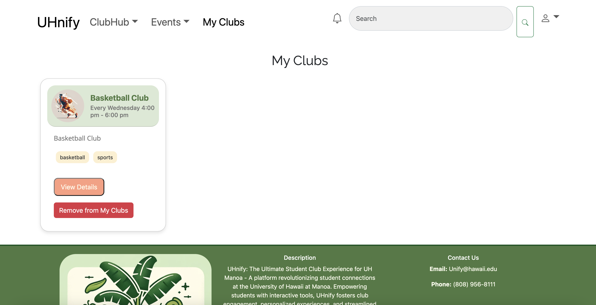

# UHnify: The Ultimate Student Club Experience for UH Manoa

Welcome to the GitHub repository for UHnify, where we're revolutionizing the way students at the University of Hawaii at Manoa connect with student clubs and each other using a comprehensive platform powered by the Meteor framework and MongoDB.

## Table of Contents
1. [Overview](#overview)
2. [System Architecture](#system-architecture)
3. [Features](#features)
4. [User Guide](#user-guide)
5. [Deployment](#deployment)
7. [Project Milestones](#project-milestones)

## Overview

UHnify aims to bring the UH Manoa student body together by:
- Enhancing the interaction between students and clubs at UH Manoa through a unified and interactive platform.
- Provide a comprehensive suite of tools for managing club activities and fostering community involvement.
- Allow students to both create their own clubs and join existing ones.
- Create an intuitive and personalized user experience that adapts to the evolving needs of the student body.

## System Architecture

UHnify's robust system architecture is composed of:
- **Backend**: MongoDB for flexible data storage paired with the Meteor framework for real-time data synchronization.
- **Frontend**: A combination of JavaScript, HTML, and CSS ensures a responsive and engaging user interface.

## Features

UHnify introduces features that make the university experience more connected and vibrant:
- **Club Discovery and Management**: Users can browse existing clubs to find that suits their interests. They can also create their own clubs.
- **Event Info**: Users can view info about upcoming events associatd with clubs they are a member of.
- **My Clubs**: Users can browse the clubs they have membership with and leave clubs they are no longer interested in.

## User Guide 

Each page on UHnify is designed to cater to specific user needs:
- **My Clubs Page**:  Here users can view clubs they are a member of.
- **Sign In Page**:  Here users sign in to their account. 
- **Browse Events Page**:  Here users can view upcoming events.
- **Browse Clubs**:  Here users can view existing clubs.
- **Add Clubs**:  Here users can create their own clubs. 

## Deployment

UHnify is deployed on Digital Ocean, providing a stable and scalable environment for our users. Access the application [here](https://uhnify.online).

## Project Milestones

We're utilizing best practices like Issue Driven Project Management (IDPM), ensuring all branches are named to enhance collaborative development and track progress on our  [Milestone 2](https://github.com/orgs/uhnify/projects/2) on GitHub.
